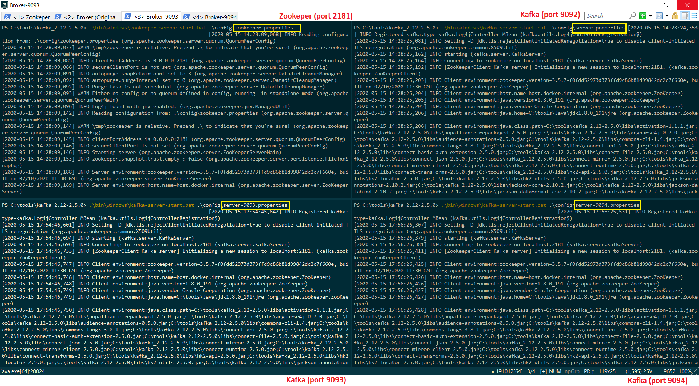
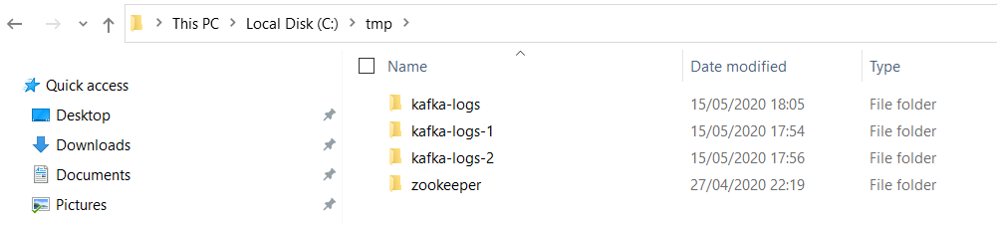
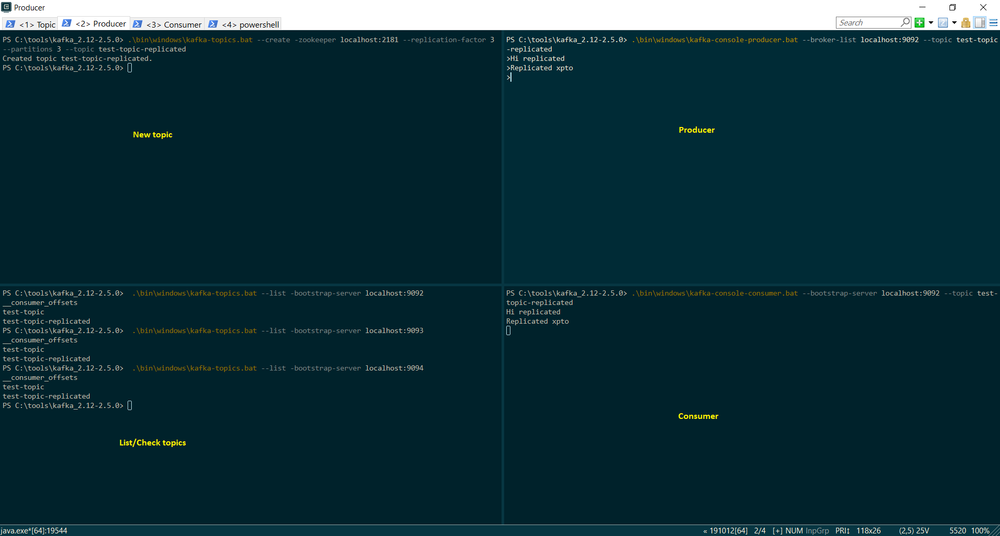
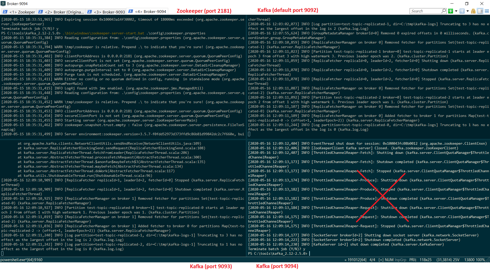
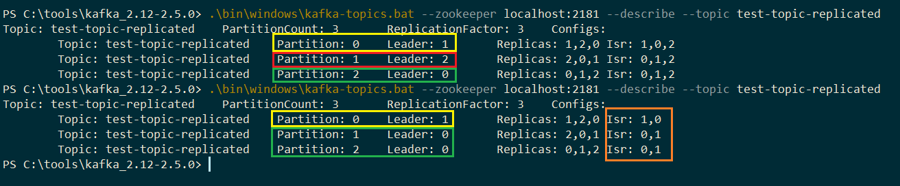

[TOC]


# Kafka


## Install

Download

https://kafka.apache.org/downloads


go to directory where you descompact Kafka installation  

*Notice*: Your path must no have empty space

> cd  c:\tools\kafka_2.12-2.5.0


## Start Server 


First you have to start **Zookeeper server**

> .\bin\windows\zookeeper-server-start.bat .\config\zookeeper.properties


**Before** start *Kafka Server* we will change the *<u>server.properties</u>*

Copy the follow line to file:


> listeners=PLAINTEXT://:9092
> auto.create.topics.enable=false


```
# see kafka.server.KafkaConfig for additional details and defaults

############################# Server Basics #############################

# The id of the broker. This must be set to a unique integer for each broker.
broker.id=0

############################# Socket Server Settings #############################

# The address the socket server listens on. It will get the value returned from 
# java.net.InetAddress.getCanonicalHostName() if not configured.
#   FORMAT:
#     listeners = listener_name://host_name:port
#   EXAMPLE:
#     listeners = PLAINTEXT://your.host.name:9092
#listeners=PLAINTEXT://:9092

listeners=PLAINTEXT://:9092
auto.create.topics.enable=false


# Hostname and port the broker will advertise to producers and consumers. If not set, 
# it uses the value for "listeners" if configured.  Otherwise, it will use the value
# returned from java.net.InetAddress.getCanonicalHostName().
#advertised.listeners=PLAINTEXT://your.host.name:9092
```


Start **Kafka server** (default port 9092)

>  .\bin\windows\kafka-server-start.bat .\config\server.properties


## General CLI Commands


### Viewing the Commit Log


> .\bin\windows\kafka-run-class.bat kafka.tools.DumpLogSegments --deep-iteration --files /tmp/kafka-logs/test-topic-0/00000000000000000000.log


### List/Check your topic

> .\bin\windows\kafka-topics.bat --list --bootstrap-server localhost:9092

```
PS C:\tools\kafka_2.12-2.5.0> .\bin\windows\kafka-topics.bat --list --bootstrap-server localhost:9092
STORE_NEW_ORDER
__consumer_offsets
test-topic
```


### Delete Topic

> .\kafka-topics.bat --zookeeper localhost:2181 --topic <<TOPIC_NAME>> --delete

```
PS C:\tools\kafka_2.12-2.5.0\bin\windows> .\kafka-topics.bat --zookeeper localhost:2181 --topic test-topic-replicated --delete
Topic test-topic-replicated is marked for deletion.
Note: This will have no impact if delete.topic.enable is not set to true.
```

> .\zookeeper-shell.bat localhost:2181
>
> ls /brokers/topics
>
> deleteall /brokers/topics/test-topic-replicated

```
PS C:\tools\kafka_2.12-2.5.0\bin\windows> .\zookeeper-shell.bat localhost:2181
Connecting to localhost:2181
Welcome to ZooKeeper!
JLine support is disabled

WATCHER::

WatchedEvent state:SyncConnected type:None path:null
ls /brokers/topics
[__consumer_offsets, test-topic, test-topic-replicated]
deleteall /brokers/topics/test-topic-replicated
ls /brokers/topics
[__consumer_offsets, test-topic]
Terminate batch job (Y/N)? y
PS C:\tools\kafka_2.12-2.5.0\bin\windows>
```


## Create a topic

Create a topic to exchange messages 

*Notice*: Your topic name shouldn't use period "." and "_"  at the same time

> .\bin\windows\kafka-topics.bat --create -zookeeper localhost:2181 --replication-factor 1 --partitions 4 --topic test-topic

```
PS C:\tools\kafka_2.12-2.5.0> .\bin\windows\kafka-topics.bat --create -zookeeper localhost:2181 --replication-factor 1 --partitions 4 --topic test-topic
Created topic test-topic.
```


## Describe Topic

Describe topic informations

> .\bin\windows\kafka-topics.bat --zookeeper localhost:2181 --describe

```
PS C:\tools\kafka_2.12-2.5.0> .\bin\windows\kafka-topics.bat --zookeeper localhost:2181 --describe
Topic: __consumer_offsets       PartitionCount: 50      ReplicationFactor: 1    Configs: compression.type=producer,cleanup.policy=compact,segment.bytes=104857600
        Topic: __consumer_offsets       Partition: 0    Leader: 0       Replicas: 0     Isr: 0
        Topic: __consumer_offsets       Partition: 1    Leader: 0       Replicas: 0     Isr: 0
        Topic: __consumer_offsets       Partition: 2    Leader: 0       Replicas: 0     
...
...
...
Topic: test-topic       PartitionCount: 4       ReplicationFactor: 1    Configs:
        Topic: test-topic       Partition: 0    Leader: 0       Replicas: 0     Isr: 0
        Topic: test-topic       Partition: 1    Leader: 0       Replicas: 0     Isr: 0
        Topic: test-topic       Partition: 2    Leader: 0       Replicas: 0     Isr: 0
        Topic: test-topic       Partition: 3    Leader: 0       Replicas: 0     Isr: 0
Topic: test-topic-replicated    PartitionCount: 3       ReplicationFactor: 3    Configs:
        Topic: test-topic-replicated    Partition: 0    Leader: 1       Replicas: 1,2,0 Isr: 1,2,0
        Topic: test-topic-replicated    Partition: 1    Leader: 2       Replicas: 2,0,1 Isr: 2,0,1
        Topic: test-topic-replicated    Partition: 2    Leader: 0       Replicas: 0,1,2 Isr: 0,1,2
```


## Producing messages 

Execute the command bellow to produce message (with or without keys).

### Without key

> .\bin\windows\kafka-console-producer.bat --broker-list localhost:9092 --topic test-topic

```
PS C:\tools\kafka_2.12-2.5.0> .\bin\windows\kafka-console-producer.bat --broker-list localhost:9092 --topic test-topic
>1
>msg 1
>message 1
>
```

### With key

>  .\bin\windows\kafka-console-producer.bat --broker-list localhost:9092 --topic test-topic --property "key.separator=-" --property "parse.key=true"


```
PS C:\tools\kafka_2.12-2.5.0> .\bin\windows\kafka-console-producer.bat --broker-list localhost:9092 --topic test-topic --property "key.separator=-" --property "parse.key=true"
>A-Apple
>A-Adam
>A-Alpha
>A-Angel
>
```


## Consuming a message 

Execute the command bellow to consume message (with or without keys or group).

#### Without key

> .\bin\windows\kafka-console-consumer.bat --bootstrap-server localhost:9092 --topic test-topic

Notice: In this example you don't see any message because you didn't define the "from" parameter (since when you can consume the message)

```
PS C:\tools\kafka_2.12-2.5.0> .\bin\windows\kafka-console-consumer.bat --bootstrap-server localhost:9092 --topic test-topic
```

Setting parameter *<u>from</u>*

> .\bin\windows\kafka-console-consumer.bat --bootstrap-server localhost:9092 --topic test-topic --from-beginning


```
PS C:\tools\kafka_2.12-2.5.0> .\bin\windows\kafka-console-consumer.bat --bootstrap-server localhost:9092 --topic test-topic --from-beginning
1
msg 1
message 1

```


If you produce another message you will see it in **both** consumers (with and without *<u>from</u>* parameter)


### With key

> .\bin\windows\kafka-console-consumer.bat --bootstrap-server localhost:9092 --topic test-topic --from-beginning -property "key.separator= - " --property "print.key=true"


```
PS C:\tools\kafka_2.12-2.5.0> .\bin\windows\kafka-console-consumer.bat --bootstrap-server localhost:9092 --topic test-topic --from-beginning -property "key.separator= - " --property "print.key=true"
null - how are you?
A - Apple
A - Adam
A - Alpha
A - Angel
null - 12311231
null - msg 1
null - hi
null - 2
null - 1
null - message 1
null - 3
a - alguem-m

```


### Group


> .\bin\windows\kafka-console-consumer.bat --bootstrap-server localhost:9092 --topic test-topic --group <group-name>


```
PS C:\tools\kafka_2.12-2.5.0> .\bin\windows\kafka-console-consumer.bat --bootstrap-server localhost:9092 --topic test-topic --group console-consumer-61640
1
2
6
7
```


## Consumer Group 


**List Consumer Groups**

> .\bin\windows\kafka-consumer-groups.bat --bootstrap-server localhost:9092 --list


## Cluster - Kafka Broker 

To create our cluster we que have to create N copies of file **<u>*server.properites*</u>** with the modifications bellow:

```
broker.id= <<NEW_ID>>
listeners=PLAINTEXT://:<<NEW_PORT>>
log.dirs=/tmp/kafka-logs-<<NEW_DIR>>
```


Original (server.properties)

```
broker.id=0
listeners=PLAINTEXT://:9092
log.dirs=/tmp/kafka-logs
```

Cluster 1 (server-9093.properties)

```
broker.id=1
listeners=PLAINTEXT://:9093
log.dirs=/tmp/kafka-logs-1
```

Cluster 2 (server-9094.properties)

```
broker.id=2
listeners=PLAINTEXT://:9094
log.dirs=/tmp/kafka-logs-2
```







To validate our cluster we will **create a new** topic <u>topic test-topic-replicated</u> after **produce** and **consume** messages

> .\bin\windows\kafka-topics.bat --create -zookeeper localhost:2181 --replication-factor 3 --partitions 3 --topic test-topic-replicated

```
PS C:\tools\kafka_2.12-2.5.0> .\bin\windows\kafka-topics.bat --create -zookeeper localhost:2181 --replication-factor 3 --partitions 3 --topic test-topic-replicated
Created topic test-topic-replicated.
PS C:\tools\kafka_2.12-2.5.0>
```


We can **check/see** that the new topic was created in all  Kafka **node**

> PS C:\tools\kafka_2.12-2.5.0>  .\bin\windows\kafka-topics.bat --list -bootstrap-server localhost:9092
> _consumer_offsets
> test-topic
> test-topic-replicated
> PS C:\tools\kafka_2.12-2.5.0>  .\bin\windows\kafka-topics.bat --list -bootstrap-server localhost:9093
> _consumer_offsets
> test-topic
> test-topic-replicated
> PS C:\tools\kafka_2.12-2.5.0>  .\bin\windows\kafka-topics.bat --list -bootstrap-server localhost:9094
> _consumer_offsets
> test-topic
> test-topic-replicated


**Producer** (You can choose the port 9092, 9093, 9094)

> .\bin\windows\kafka-console-producer.bat --broker-list localhost:9092 --topic test-topic-replicated

**Consumer** (You can choose the port 9092, 9093, 9094)

> .\bin\windows\kafka-console-consumer.bat --bootstrap-server localhost:9092 --topic test-topic-replicated





## In-Sync Replica (ISR) 


* Represents the  number of replicas in sync with each other in the cluster
  * Includes both **LEADER** and **FOLOWER** replica
* Recommended value is always **greater** than 1
* Ideal value is **ISR == Replicator Factor**
* This can be controlled by **min.insync.replica** properties
  * It can be set at the <u>Broker</u> or <u>Topic</u> level


The example bellow will show the replication in action (We are using the cluster created earlier).

* Describe  the topic informations (test-topic-replicated)

  Notice that each broker is leader of one topic

> .\bin\windows\kafka-topics.bat --zookeeper localhost:2181 --describe --topic test-topic-replicated

```
PS C:\tools\kafka_2.12-2.5.0> .\bin\windows\kafka-topics.bat --zookeeper localhost:2181 --describe --topic test-topic-replicated
Topic: test-topic-replicated    PartitionCount: 3       ReplicationFactor: 3    Configs:
        Topic: test-topic-replicated    Partition: 0    Leader: 1       Replicas: 1,2,0 Isr: 1,0,2
        Topic: test-topic-replicated    Partition: 1    Leader: 2       Replicas: 2,0,1 Isr: 0,1,2
        Topic: test-topic-replicated    Partition: 2    Leader: 0       Replicas: 0,1,2 Isr: 0,1,2
```

* Shutdown the one Broker/Node  (broker.id=2 - port 9094)



* Describe  the topic again

  Notice that now the broker.id "0" is leader of 2 partitions (partition 1 and 2)  and ISR has only values 0 and 1.

> .\bin\windows\kafka-topics.bat --zookeeper localhost:2181 --describe --topic test-topic-replicated

```
PS C:\tools\kafka_2.12-2.5.0> .\bin\windows\kafka-topics.bat --zookeeper localhost:2181 --describe --topic test-topic-replicated
Topic: test-topic-replicated    PartitionCount: 3       ReplicationFactor: 3    Configs:
        Topic: test-topic-replicated    Partition: 0    Leader: 1       Replicas: 1,2,0 Isr: 1,0
        Topic: test-topic-replicated    Partition: 1    Leader: 0       Replicas: 2,0,1 Isr: 0,1
        Topic: test-topic-replicated    Partition: 2    Leader: 0       Replicas: 0,1,2 Isr: 0,1
```

